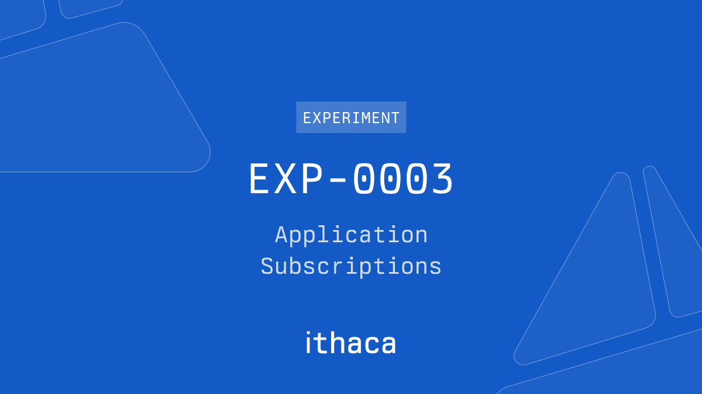

# EXP-0003: Application Subscriptions



[Read the Blog Post](https://ithaca.xyz/updates/exp-0003)

## Overview

<details>
  <summary>Sequence Diagram</summary>

  ```mermaid  
  sequenceDiagram
    autonumber
    participant C as Client
    participant S as Server
    participant P as Porto
  
    C ->> S: GET /keys/:address?expiry&expiry=
    S ->> S: keyPair = P256.randomKeyPair()
    note right of S: Server encrypts and saves privateKey
    S -->> C: { type: 'p256', publicKey }
    C ->> P: experimental_grantPermissions(permissions)
    C -) S: POST /schedule <br/> { address, action: "mint", "schedule": "*****" }
    loop CRON
        S ->> P: { digest, request } = wallet_prepareCalls(calls)
        S ->> S: signature = P256.sign(digest, key)
        S ->> P: hash = wallet_sendPreparedCalls(request, signature)
    end
  ```

</details>

### Live demo

- <a href="https://exp-0003-client.evm.workers.dev" target="_blank">exp-0003-client.evm.workers.dev</a> - Client
- <a href="https://exp-0003-server.evm.workers.dev" target="_blank">exp-0003-server.evm.workers.dev</a> - Server

### Keywords

- Client: frontend application running in the browser,
- Server: handles key generation, preparing and sending calls, scheduling and managing CRON jobs.

## Getting Started

### Prerequisites

- [Node.js (LTS)](https://nodejs.org/en)
- enable [`corepack`](https://github.com/nodejs/corepack) using `corepack enable`
- install dependencies using `pnpm install`

Setup environment variables

```shell
# replace values with your own cloudflare account id and API token
cp .env.example .env
```

### Setup Server database (Cloudflare D1)

```shell
# create database (this will fail if the database already exists)
pnpm --filter='server' db:create
# bootstrap the existing database. for local development
pnpm --filter='server' db:bootstrap
# bootstrap the remote database
pnpm --filter='server' db:bootstrap:remote
```

> [!NOTE]
> if you want https setup for local development:
>
> - install [caddy](https://caddyserver.com/docs/install) `brew install caddy`,
> - run `caddy run --config=Caddyfile`
> - set `VITE_SERVER_URL` to `https://server.localhost` in `client/.env`

### Start dev for worker and client

```shell
pnpm --filter='server' --filter='client' dev
```

## Deploying

### Requirements

- a Cloudflare account
- `wrangler` CLI: `pnpm add --global wrangler@latest`,
- authenticate with `wrangler login`

### Deploy client

```shell
cd client
pnpm build

pnpm wrangler deploy --config='wrangler.json'
```

### Deploy worker

```shell
cd server

pnpm wrangler deploy --config='wrangler.json'
```
